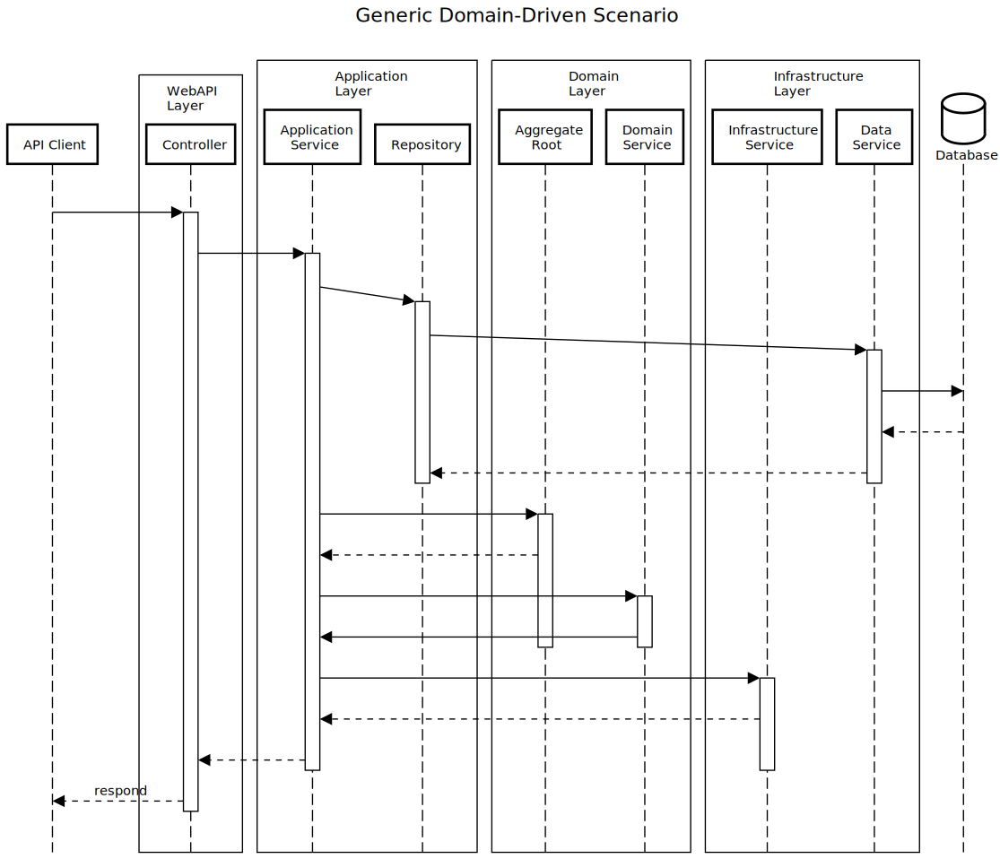
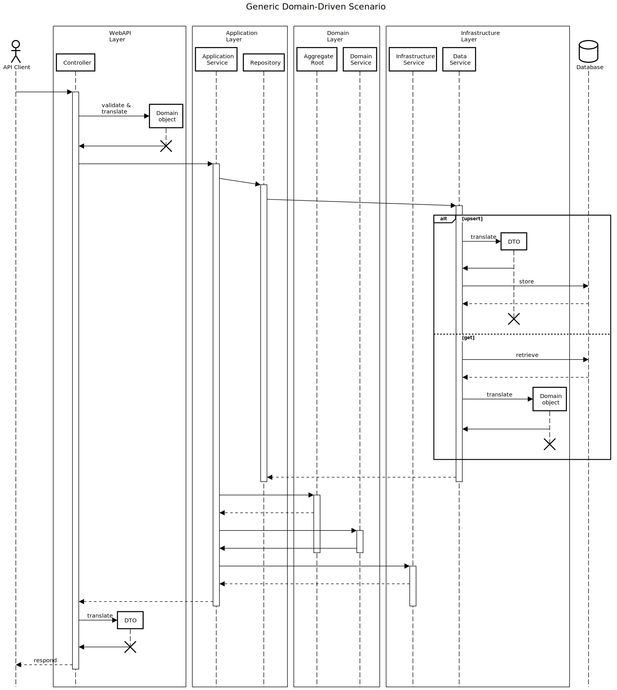

# Readme

<!--
Tenets:

- Messages are DTOs [Dahan]
- MVC models are messages [Ritchie]
- DTOs require adaptation to to domain objects (aggregates, entities, value objects). [Ritchie]
- "Application service are responsible for task coordination of use case flows, one service method per flow". [Vernon]
- [An application service is a command handler for a specific aggregate. One aggregate has one application service whose purpose is to orchestrate how commands will be fulfilled.](https://github.com/Elders/Cronus/blob/master/docs/cronus-framework/domain-modeling/handlers/application-services.md#:~:text=an%20application%20service%20is%20a%20command%20handler%20for%20a%20specific%20aggregate.%20one%20aggregate%20has%20one%20application%20service%20whose%20purpose%20is%20to%20orchestrate%20how%20commands%20will%20be%20fulfilled)
- "Command Handler (semantically an Application Service)" [Vernon]
- Application Services are command handlers that handle a use case. --> <!--"Application Services are command handlers ... [that handle a use case]"-->
<!--
  - A application service has a one-to-one relationship with an aggregate as an application-level aggregate facade. [Ritchie, paraphrasing Evans?]
- "Integration across the boundaries necessarily will involve some translation, which you can analyze explicitly." [Evans]
- "Integration of functionality and data [across bounded contexts] must go through a translation. 
  - An Anti-corruption layer is composed of an adapter and a translator.

- "[Two bounded contexts ] are not in the same CONTEXT and should stop trying to share code until some changes are made." [Evans]
- "Code reuse between BOUNDED CONTEXTS is a hazard to be avoided." [Evans]
- [A Context Map Describes] the points of contact between the models, outlining explicit translation for any communication and highlighting any sharing. 
- Upstream and downstream subsystems separate naturally into two BOUNDED CONTEXTS. 

**
A message, or anything arriving over-the-wire (transport) is modeled as a DTO to the receiver.  The message data has transport-level constraints that are often at odds with the application/domain constraints and must be validated and translated before being "executed."
**

Smells:

 - There isn't a one-to-one relationship between application services and aggregates. [Ritchie]

Practices:

- Command always through web API. [Ritchie]
- Web API Validates, Domain Validates, Adapters Validate
- Adapters always involve translation or a translator. [Ritchie] or [Martin]
-->
Structure:

- `Domain`
  - _References only generic base-class libraries_
  - Contains entities and value objects in the root, with sub-folders for concepts like Commands, Events, and Domain Services.
  - `Services`
    - Domain Services: stateless containers of domain-level interaction between domain objects.
  - `Commands`
    - A abstraction of a request for a change in state.  Usually involves one or more events being published.
  - `Events`
    - A abstraction of a record of a past state change.
  - `Builders`
    - Used to build instances of domain objects (Aggregates, Entities, Commands, Events, etc.), enforcing and validating (via validators) invariants.  Like factories, but present a domain-specific fluent interface that .
    - `Validators`
      - Encapsulates some of the critical business logic relating to invariants relating to instantiating domain objects. 
  - `Exceptions`
    - Domain-specific exceptions (e.g. `EntityNotFoundException`, `EntityAlreadyExistsException`, etc.)
  - `Abstractions`
    - interfaces, repositories, etc.
- `Application`
  - _References Domain_
  - `Services`
    - Application services; responsible for task coordination of use case flows, one service method per flow. \[Vernon, _Implementing Domain-Driven Design_ p. 521\]
  - `Commands`
    - Application commands that cross aggregate boundaries; referencing domain objects
  - `Events`
    - Application events that cross aggregate boundaries; referencing domain objects
  - `Translators`
    - Used within adapters to translate the data from one interface to another, leveraging builders and validators from the Domain
    - `Builders`
      - Used to build instances of application objects, making use of validators to enforce application-level invariants.
    - `Validators`
      - Used when translating between domain events/commands and application events/commands
  - `Exceptions`
    - Domain exceptions that are not specific to an particular aggregate.
  - `Abstractions`
- `Infrastructure`
  - _References Domain and Application, and frameworks_
  - The infrastructure-level implementation details of the Application and Domain Layers.
  - `Services`
    - Infrastructure Services
  - `Abstractions`
    - Interfaces and base classes relating to infrastructure
  - `Persistence`
    - Infrastructure Services and generic base classes implementing data persistence.
  - `Dtos`
    - Objects representing the shape of data required to communicate to external services.
    - `Translators`
      - Translates DTOs to domain-objects (and vice-versa), making use of Builders and Validators to enforce invariants relating to instantiation of domain objects.
    - `Builders`
      - Encapsulates the rules for instantiating domain objects, making use of Validators
    - `Validators`
      - Validation code that enforces invariants relating to infrastructure DTOs. _May mirror Domain-level invariants_.
  - `Exceptions`
    - Infrastructure-specific exceptions.
  - Implementations?
    - Persistence? (repository implementations, specifications, etc.)
- `WebAPI`
  - _References both Domain and Infrastructure_(?).
  - `Dtos`?
    - `Validators`
      - Validation code that enforces invariants relating to WebAPI DTOs.  _May mirror Domain-Level invariants_.
    - `ApplicationCommandDtos`?
      - `Translators`
      - `Validators`
    - `ApplicationEventDtos`?
      - `Translators`
      - `Validators`
  - `Controllers`
    - Obvious
  - `Infrastructure`
    - TODO:
- `Endpoint`
  - References both Domain and Infrastructure?
  - **todo**:
- `Tests`

## Details

### The difference between Application Services and Infrastructure Services.

The Application Layer contain use cases (that are collaborations of application services and domain objects).  Concepts in the Application Layer are _Domain focused_.  For example, in a domain there may be an abstract concept like _notification_: something in the domain may need to notify something else in the domain.  Kow that notification is realized needs to be implemented _in the real world_.  So, within the scope of the application there may be a Notification Service.  The implementation (i.e. the infrastructure behind the notification service) may be to send an email, so it ends up being a wrapper to an Infrastructure Service (Email Sender).

## Flow Relationships

Basic Flow

More Detailed Flow

## WebAPI

DTO are anemic data containers. Validation, serialization, etc. requirements use asp.net specific attributes. 

### Infrastructure

### Application
Is this just application services?  Be clear about the distinction of application services.

## Core (Domain)

Core shouldn't know about front-ends, so translation to/from domain happens in front-end.

Domain classes have all read-only properties, mutation is done through methods (ala Command Query Separation.)

## Infrastructure

## Tests

Test names detail the expectation, no need for assert text.

Tests verify controllers via test server.

[Vernon]: https://todo
[Dahan]: https://todo
<!--
John: places for EDA to fit... 
-->
<!--
Evans' services:
- routing service
- NetworkTraversalService
- NetListImportService
- QueryService

Vernon's Services:
- DiscussionService (domain)
- SchedulingService (domain)
- TenantIdentityService (application)
- tenantProvisioningService
- CustomerApplicationService (application)
- pricingService (domain)
-->
